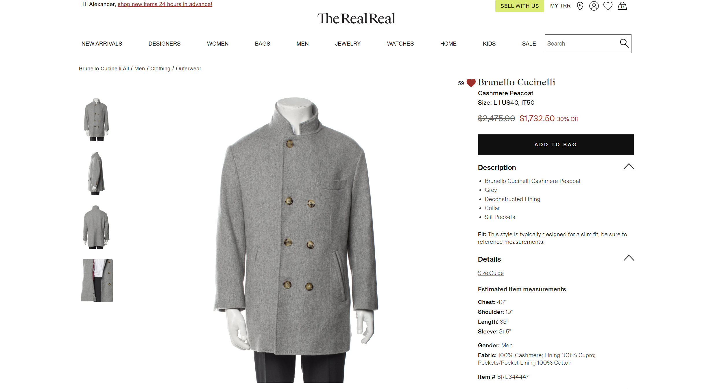

# The Failings of Luxury E-Commerce

### By Alexander Haga | March 13, 2025

## Prelude

Over the years, I have found myself drawn to TheRealReal—a luxury consignment marketplace that promises both the acquisition of exquisite pieces and the graceful retirement of one's gently-used finery. My objective, a few days ago, was straightforward: to purchase a particular Brunello Cucinelli cashmere peacoat while simultaneously arranging for several of my own garments to be consigned through their service.
What should have been a refined experience befitting the luxury market segment instead illustrated to me that even the most sophisticated platforms can fail in providing **usability**—the measurement of how easily a user can accomplish their goals when using a service.

## Act I: The Hunt

I had purchased with TheRealReal before, and had noted their commendable strengths. Their search functionality provided adequate filtering options, allowing me to narrow my quest specifically to Brunello Cucinelli outerwear in my size. The product photography was exemplary, displaying the peacoat from multiple angles with appropriate detail shots highlighting the craftsmanship of the cashmere and stitching.
The product page itself presented a clean **information architecture**—a term I use to describe how content is organized and structured to facilitate understanding. Specifications about the garment's condition, measurements, and provenance were clearly delineated, providing the necessary confidence to proceed with such a significant purchase.

## Act II: The Consignment

It was here that my experience descended into poor **task flow**—the sequence of steps required to complete a goal. While my shopping cart now contained the coveted peacoat, there appeared to be no clear pathway to simultaneously arrange for my own items to be consigned.
The navigation offered a separate "Sell" section, which I dutifully explored. Here, the **mental model**—my understanding of how the system works based on my previous experiences and expectations—suggested that I should be able to initiate both transactions in parallel, perhaps with some acknowledgment of the relationship between the two. This reasonable expectation was met with disappointment. 
The consignment process existed in what appeared to be an entirely separate universe from the purchasing flow. No option to combine these related activities was presented, despite the obvious symbiosis between buying and selling on a consignment platform. This disconnect severely impacted the **effectiveness** of the platform—the degree to which a system enables users to achieve their specific goals completely and accurately. Despite my technical proficiency, I was unable to complete what should have been a basic combined transaction, rendering the digital interface ineffective for my particular use case. This represents a significant failure in **user-centered design**, which prioritizes creating systems that align with users' goals and natural workflows rather than forcing users to adapt to arbitrary system limitations.

## Act III: The Call

After several increasingly frustrated attempts to navigate this bifurcated experience, I was reduced to that most primitive of customer service interactions—the phone call. My personal customer support attendant, while courteous, confirmed what the interface had already made painfully clear: the system was not designed to accommodate the concurrent buying and selling that would seem fundamental to a consignment business model.
The attendant manually arranged both transactions, essentially serving as a human interface to bypass the digital **usability barriers**—obstacles in a system that prevent users from efficiently achieving their goals. 
The necessity of this human intervention significantly diminished my **satisfaction**—the comfort and positive attitudes generated during the use of the system. What should have been a seamless digital experience was instead a journey requiring additional time and effort, precisely the opposite of what one expects from a luxury service promising convenience.

## Denouement

TheRealReal's interface suffers from a failure of **contextual inquiry**—the process of understanding users in the context of their actual goals. For a luxury consignment platform, the common scenario of a customer both buying and selling simultaneously appears to have been overlooked entirely in the design process.
The strengths of the platform—beautiful photography, detailed product information, and straightforward purchasing—are undermined by this fundamental disconnect in the user journey. The platform demonstrates a concerning lack of **integration** between its core functions, forcing unnecessary context-switching that diminishes the overall experience.

## Recommendations

Were I to suggest improvements:

- Implement a unified transaction flow that allows users to both purchase and consign in a single session, perhaps with an "Add to My Consignment" option alongside the traditional "Add to Cart" button.
- Create **affordances**—visual cues that indicate possible actions—that suggest the relationship between buying and selling within the interface.
- Develop a dedicated section for users who frequently engage in both activities, acknowledging this common use case with appropriate shortcuts and persistent information.
- Introduce contextual prompts that suggest consignment opportunities when a purchase is being made, and vice versa, to create a more cohesive experience.

A platform serving the luxury market should demonstrate the same attention to detail and seamless experience that one expects from a fine establishment. TheRealReal's current implementation, while showing promise in isolated areas, ultimately fails to provide the integrated experience befitting its clientele. Unfortunately, my overall impression of TheRealReal is, regrettably, diminished. How rude.

